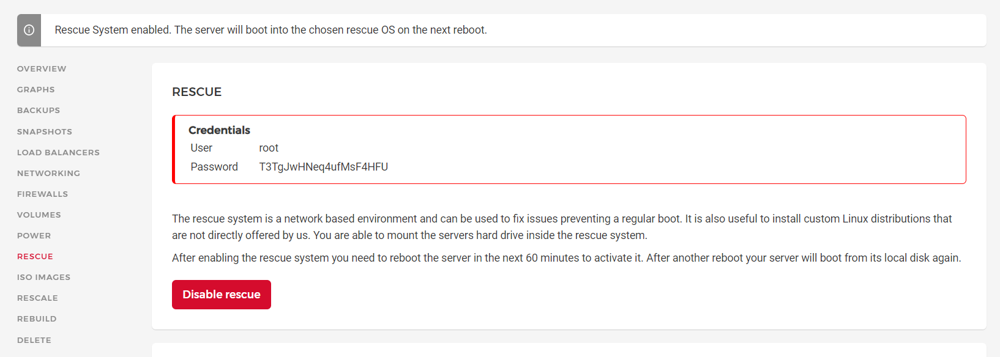

# LVM на Hetzner. Часть 1.

В этот раз обойдемся без лирики и долгих вступлений. Если вы читаете этот текст значит знаете что такое LVM и для чего оно надо. Также следует отметить, что бесконечное количество гайдов циркулирующих в сети не учитывают некоторых специфичных моментов, которые могут поставить в тупик неподготовленного пользователя. Постараюсь пролить туда свет.

Для большей наглядности обозначим конфигурацию: VPS CPX11 на Hetzner (2/2/40). В процессе добавим диск 25Gb с целью получить один том размером ~60Gb. Размеры взяты для примера. Получив базовое понимание принципа не составит особого труда адаптировать его на любого другого провайдера.

Итак, по большому счету, существует два варианта организации LVM на Hetzner'e, на этапе создания сервера и на работающей системе. Рассмотрим их по порядку.

## Вариант #1. Rescue mode.

Нюанс первый. В силу непонятной специфики, активация нескольких дисков LVM в Rescue mode, требует чтобы диски были одинакового размера, иначе в качестве максимального размера будет взят диск меньшего объема, по сути RAID0. Т.е. в нашей конфигурации вместо 65Gb (40Gb + 25Gb) получим 50Gb (25Gb*2). Для того чтобы обойти это ограничение необходимо:

- перед началом установки отключить дополнительный диск, либо не покупать его на этом этапе вообще
- установить систему, попутно включив основной диск в режим LVM
- уже на работающей системе добавить второй/третий/пятый диск. Таким образом получаем достаточную свободу действий.

### Поехали. 

Имеем чистый сервер после первой загрузки. Смотрим что по дискам:

```
lsblk
```

```
NAME    MAJ:MIN RM  SIZE RO TYPE MOUNTPOINT
sda       8:0    0 38.2G  0 disk			# исходный диск
├─sda1    8:1    0 37.9G  0 part /			# этот раздел будем объединять
├─sda14   8:14   0    1M  0 part 
└─sda15   8:15   0  256M  0 part /boot/efi
sr0      11:0    1 1024M  0 rom
```

В консоли Hetzner включаем Rescue mode (в rescue отдельная учетка).



Перезагружаемся и логинимся в rescue. В консоли восстановления начинаем установку с нуля:

```
installimage
```

Выбираем образ системы для установки (Ubuntu 20.04 minimal), нас уведомляют о том что сейчас будет конфиг. Собственно интересующая нас часть конфига:


Для сохранения времени, укажу лишь те параметры которые требуют нашего вмешательства

```
PART /boot  ext3     512M		# загрузочный раздел, снимаем комментарий, остальное не трогаем
PART lvm    vg0       all		# снимаем комментарий, остальное без изменений
...
LV vg0   root   /        ext4         all	# приводим к такому виду.
#LV vg0   swap   swap     swap          4G	# все остальные параметры не трогаем если не знаем что это.
#LV vg0   tmp    /tmp     reiserfs      5G	# если все-таки меняем что-либо, то корневой раздел '/' должен идти 
#LV vg0   home   /home    xfs          20G	# последней строкой 
```

Итоговый вариант выглядит так:


Сохраняемся через F10, соглашаемся с несколькими предупреждениями и смотрим на завершение установки:

```

                Hetzner Online GmbH - installimage

  Your server will be installed now, this will take some minutes
             You can abort at any time with CTRL+C ...

         :  Reading configuration                           done 
         :  Loading image file variables                    done 
         :  Loading ubuntu specific functions               done 
   1/16  :  Deleting partitions                             done 
   2/16  :  Test partition size                             done 
   ...
```

Перезагружаемся:

```
reboot
```

Логинимся и смотрим что изменилось по сравнению с первым скрином.

```
lsblk
```

```
NAME         MAJ:MIN RM  SIZE RO TYPE MOUNTPOINT
sda            8:0    0 38.2G  0 disk 
├─sda1         8:1    0  512M  0 part /boot
└─sda2         8:2    0 37.7G  0 part 			# бывший sda1
  └─vg0-root 253:0    0 37.7G  0 lvm  /			# поменял тип на lvm и включен в группу vg0
sr0           11:0    1 1024M  0 rom
```

### Цепляем второй диск

Вкратце опишу уровни LVM. Физические диски (PV = PhysicalVolume) помечаются  для использования в LVM, объединяются в группы томов (VG = VolumeGroup) которые потом нарезаются на логические тома (LV = LogicalVolume) произвольного размера.

Поехали. Докупаем диск (согласно конфигу 25Gb), оставляем дефолтные значения подключения  (mount options: Automatic, file system: ext4). Смотрим текущую ситуацию:

```
lsblk
```

```
NAME         MAJ:MIN RM  SIZE RO TYPE MOUNTPOINT
sda            8:0    0 38.2G  0 disk 
├─sda1         8:1    0  512M  0 part /boot
└─sda2         8:2    0 37.7G  0 part 
  └─vg0-root 253:0    0 37.7G  0 lvm  /
sdb            8:16   0   25G  0 disk 			# наш новый диск (automatic mount не сработал)
sr0           11:0    1 1024M  0 rom
```

Создаем раздел на свежем диске (ориентируемся по комментариям), по сути пишем только `n` остальное дефолт и записываем изменения `w`:

```
fdisk /dev/sdb
```

```
Welcome to fdisk (util-linux 2.34).
Changes will remain in memory only, until you decide to write them.
Be careful before using the write command.
The old ext4 signature will be removed by a write command.
Device does not contain a recognized partition table.
Created a new DOS disklabel with disk identifier 0x628d10a4.

Command (m for help): n								# n - создаем новый раздел
Partition type
   p   primary (0 primary, 0 extended, 4 free)
   e   extended (container for logical partitions)
Select (default p): p								# p - primary (default)
Partition number (1-4, default 1): 1				  # жмем enter (default)
First sector (2048-52428799, default 2048): 							          # default
Last sector, +/-sectors or +/-size{K,M,G,T,P} (2048-52428799, default 52428799):	# default 

Created a new partition 1 of type 'Linux' and of size 25 GiB.

Command (m for help): w							   								# w - записываем изменеия
The partition table has been altered.
Syncing disks.
```

Форматируем:

```
root@rroad-lvm ~ # umount /dev/sdb							# надо убедиться что диск не примонтирован
root@rroad-lvm ~ # mkfs.ext4 /dev/sdb1						# форматируем в ext4
```

```
mke2fs 1.45.5 (07-Jan-2020)
Discarding device blocks: done                            
Creating filesystem with 6553344 4k blocks and 1638400 inodes
Filesystem UUID: 9d0cc7e3-7fc5-4a2d-ac92-e2b4dc39de93
Superblock backups stored on blocks: 
        32768, 98304, 163840, 229376, 294912, 819200, 884736, 1605632, 2654208, 
        4096000

Allocating group tables: done                            
Writing inode tables: done                            
Creating journal (32768 blocks): done
Writing superblocks and filesystem accounting information: done  						 # все прошло гладко
```

Инициализируем диск LVM:

```
pvcreate /dev/sdb1
```

```
WARNING: ext4 signature detected on /dev/sdb1 at offset 1080. Wipe it? [y/n]: y
  Wiping ext4 signature on /dev/sdb1.
  Physical volume "/dev/sdb1" successfully created.
```

Добавляем /dev/sdb1 в группу томов (vg0) созданную ранее в Rescue.

```
vgextend vg0 /dev/sdb1
```

```
Volume group "vg0" successfully extended
```

Сканируем диски LVM:

```
lvmdiskscan -l
```

```
  WARNING: only considering LVM devices
  /dev/sda2 [     <37.65 GiB] LVM physical volume
  /dev/sdb1 [     <25.00 GiB] LVM physical volume
  0 LVM physical volume whole disks
  2 LVM physical volumes
```

Смотрим текущие логические тома:

```
lvdisplay
```

```
--- Logical volume ---
  LV Path                /dev/vg0/root						# текущий lv том
  LV Name                root
  VG Name                vg0
  LV UUID                WmUgCr-PuXN-jveP-GKin-z6Jf-sNzK-xFI2HH
  LV Write Access        read/write
  LV Creation host, time rescue, 2022-12-13 13:14:18 +0100
  LV Status              available
  # open                 1
  LV Size                37.64 GiB
  Current LE             9637
  Segments               1
  Allocation             inherit
  Read ahead sectors     auto
  - currently set to     256
  Block device           253:0
```

И, наконец, расширяем логический том, чтобы включить второй диск и использовать все доступное пространство:

```
lvextend -l +100%FREE /dev/vg0/root
```

```
Logical volume "lv0" created.Size of logical volume vg0/root changed from 37.64 GiB (9637 extents) to 62.64 GiB (16036 extents).
  Logical volume vg0/root successfully resized.
```

Ресайзим свободное место:

```
resize2fs /dev/vg0/root
```

```
resize2fs 1.45.5 (07-Jan-2020)
Filesystem at /dev/vg0/root is mounted on /; on-line resizing required
old_desc_blocks = 5, new_desc_blocks = 8
The filesystem on /dev/vg0/root is now 16420864 (4k) blocks long.
```

Смотрим что получилось:

```
df -h
```

```
Filesystem            Size  Used Avail Use% Mounted on
udev                  937M     0  937M   0% /dev
tmpfs                 194M  736K  193M   1% /run
/dev/mapper/vg0-root   62G  1.4G   58G   3% /				# собственно, получили то что планировали 
tmpfs                 968M     0  968M   0% /dev/shm
tmpfs                 5.0M     0  5.0M   0% /run/lock
tmpfs                 968M     0  968M   0% /sys/fs/cgroup
/dev/sda1             488M   85M  378M  19% /boot
tmpfs                 194M     0  194M   0% /run/user/0
```

Видим, что получилось все и как надо. Осталось убедиться что LV будет монтироваться автоматом. Вспоминаем название текущего LV тома (`/dev/vg0/root`) и сравниваем с записью в `fstab`:

```
cat /etc/fstab
```

```
proc /proc proc defaults 0 0
# /dev/sda1
UUID=c5c6cf18-15aa-46e6-a15f-d1c9c9ae9153 /boot ext3 defaults 0 0
# /dev/sda2 belongs to LVM volume group 'vg0'
/dev/vg0/root  /  ext4  defaults 0 0							# будет смонтирован автоматически
```

На этом можно себя поздравить, задача выполнена. Во второй части разберемся как добавить диск на рабочую систему. Всем удачи.

PS. Все вопросы, обнаруженные косяки и неточности мне в тг: @ryssroad

PPS. Не забываем поставить звезду в этот репо )
